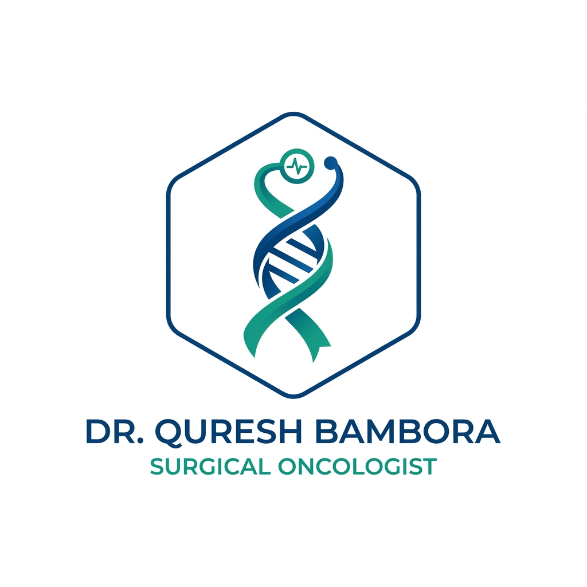

# MS Infinix — Premium Healthcare Solutions



MS Infinix is a state-of-the-art medical website designed with a focus on **Liquid Glass Aesthetics** and **Modern Healthcare Excellence**. This platform provides a seamless digital experience for patients looking for premium medical services and expert care.

## ✨ Key Features

- **🏆 Premium Aesthetic**: Modern UI with deep glassmorphism effects and sophisticated micro-interactions.
- **📱 Fully Responsive**: Optimized for all devices, from desktop monitor to mobile smartphone.
- **🚀 Ultra Fast**: Built on Vite + React for lightning-fast loading and smooth page transitions.
- **🔍 SEO Ready**: Fully optimized with meta tags, Open Graph properties, and semantic HTML.
- **👨‍⚕️ Patient Centric**: Features like appointment booking, service showcases, and interactive FAQs.

## 🛠️ Technology Stack

- **Framework**: [React](https://reactjs.org/)
- **Build Tool**: [Vite](https://vitejs.dev/)
- **Styling**: Vanilla CSS (Custom Glassmorphism System)
- **Icons**: [Lucide React](https://lucide.dev/)
- **Animations**: [Framer Motion](https://www.framer.com/motion/)
- **Routing**: [React Router](https://reactrouter.com/)

## 🚀 Getting Started

### Prerequisites

- [Node.js](https://nodejs.org/) (Latest LTS)
- npm or yarn

### Installation

1. Clone the repository:
   ```bash
   git clone https://github.com/Eshbanoliver/doctorwebsite.git
   ```

2. Install dependencies:
   ```bash
   npm install
   ```

3. Start the development server:
   ```bash
   npm run dev
   ```

## 📂 Project Structure

```text
├── public/          # Static assets (favicons, etc.)
├── src/
│   ├── assets/      # Project images and logo
│   ├── components/  # Reusable UI components
│   ├── pages/       # Page views (Home, About, Services, etc.)
│   ├── App.jsx      # Main Application component
│   └── index.css    # Global styles and design system
└── index.html       # HTML Entry point
```

## 📸 Branding

The project uses the custom **MS Infinix** brand identity:
- **Primary Color**: Royal Blue (`#2563eb`)
- **Accent Color**: Teal (`#14b8a6`)
- **Typography**: Inter / Sans-serif

---

Developed with ❤️ by [Eshban Oliver](https://github.com/Eshbanoliver)
